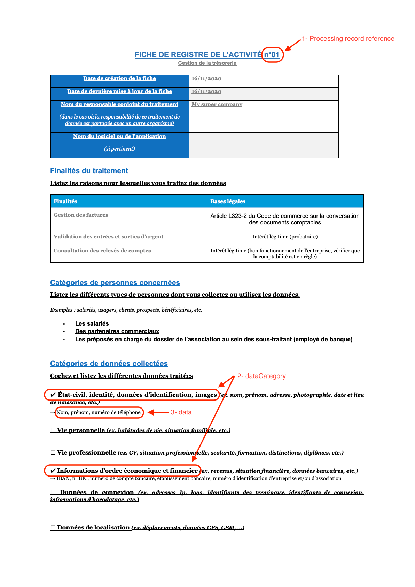

# Describing data models (developer work)

Here are the elements you, as a developer, need to look for the processing records your DPO gave to you:  



Let's say that you store: 

- the 'nom' of your users in the 'last_name' field of a 'users' PostgreSQL table. 

- the 'numéro de téléphone' in the 'phone_number' field of a 'phones' table

- the IBAN, BIC, 'numéro de compte'... as a single image inside a S3 bucket (strange idea but no one is perfect) called 'iencli_bank_account_infos'

- the 'prénom' as a physical paper in a real library. Yeah, even if you've decided to print some of your user infos (because why not) instead of storing it numerically, Alias is able to reference them.

You can reference this data in the Alias system by sending a simple JSON object which look like that:

```json
 {
   "items": [
    {
      "processingRecordRef": 1, // it's the processing record number
      "dataCategories": [
        {
          "name": "Etat-civil, identité, données d'identification, images",
          // the name of the dataCategory in the processing record
          "dataModel": [
            {
              "location": "users/last_name",
              "description": "nom", 
              // optional, used to help your DPO to understand the content of the data
              "storage_type": "db_field"
            },
            {
              "location": "phones/phone_number",
              "storage_type": "db_field"
            },
            {
              "location": "bibliotheque-de-ma-super-entreprise/allee-22/dossier-prenoms",
              "description": "prénom",
              "storage_type": "physical_paper"
            }
          ]
        },
        {
          "name": "Informations d'ordre économique et financier",
          "dataModel": [
            {
              "location": "https://iencli_bank_account_infos.fr",
              "description": "PNGs contenant les informations bancaires de nos clients",
              "storage_type": "bucket"
            }
          ]
        }
      ]
    },
  ]
 }
```

When you have done, you can take some rest and let your DPO take the lead for the next step. 

## Mapping data models to processing records (DPO work)

