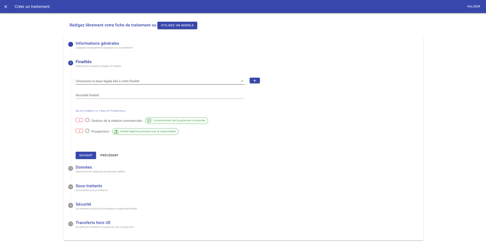
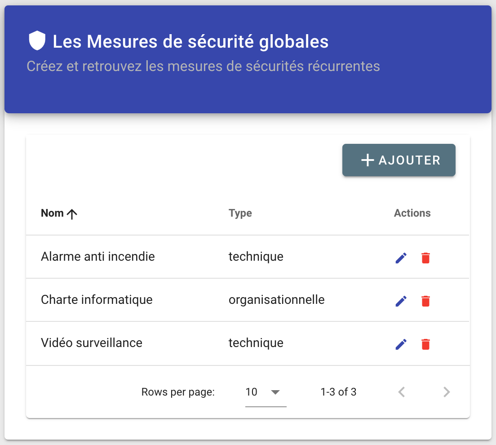
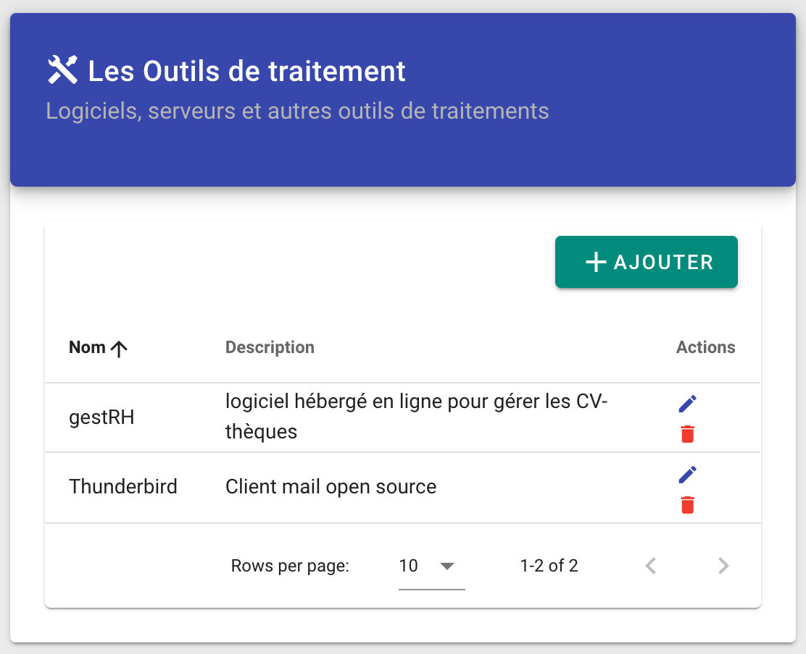
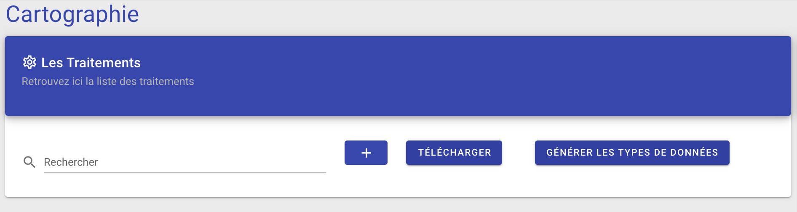

# Numériser les fiches de traitement (travail du DPO)

Le registre des fiches de traitement agrège les règles légales qui s'appliquent sur les données récoltées par une entreprise sur ses utilisateurs.

La première action nécessaire pour mettre en route Alias est de saisir ces fiches sur l'interface DPO fournie par Alias. 

Après l'étape de connexion, le DPO est invité à mettre à jour les informations relatives aux organisations qu'il suit.

Une fois ces informations remplies, le DPO peut alors saisir de nouvelles fiches de traitement dans Alias DPO UI en cliquant sur le bouton "+" dans la section "Cartographie".

Après avoir validé une fiche de traitement, une partie des informations qu'elle contient devient visible dans les sections "Les mesures de sécurités globales", "les outils de traitement", les "Transferts Hors-UE" et "Sous-traitance".

Une fois les fiches de traitement renseignées dans le système, le DPO clique sur 'Générer les types de données' afin de créer un objet JSON contenant tous les types de données répertoriées dans les fiches de traitement.

