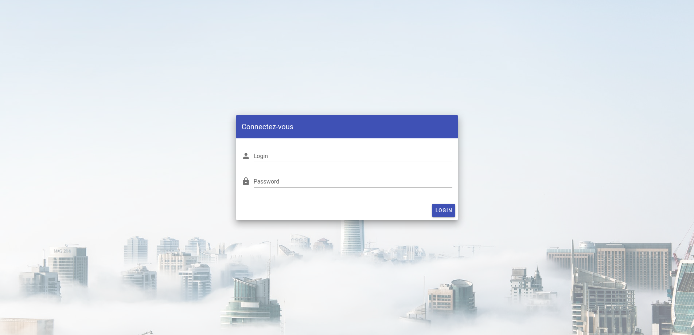
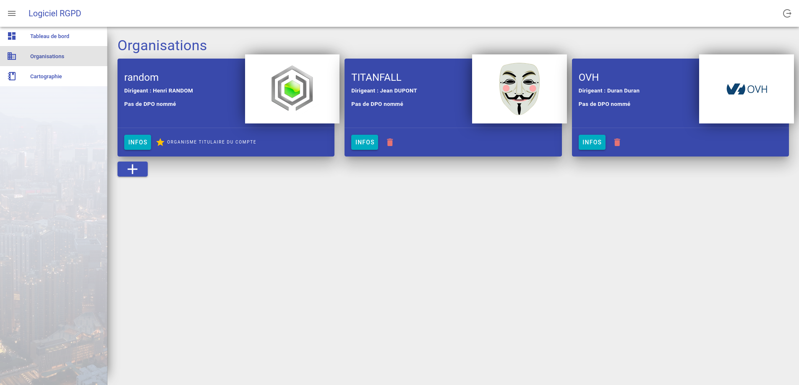

# Entering processing records (DPO work)

The first action that is required from the DPO (ie. "Data protection officer"), is to firstly enter the processing records of the data controller into ALIAS.

To do so, the DPO is given a web hosted well designed UI (ie. "User interface) dedicated to that end. 

The first step is then to login, using the credentials that CODE IS LAW sent to him after the subscription to ALIAS.

When the DPO is logged in, he can check and complete the informations related to its organization, and the ones of its providers and partners. To do so, the DPO can use the "Organizations" section.

